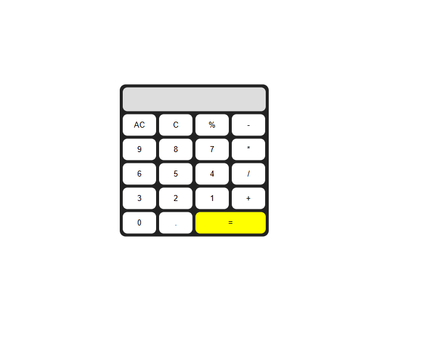

# 🧮 Mini Calculator (Taschenrechner)

Ein einfacher **Web-Taschenrechner**, erstellt mit **HTML**, **CSS** und **JavaScript**.  
Er bietet grundlegende mathematische Operationen wie Addition, Subtraktion, Multiplikation und Division.

---

## 🚀 Demo

👉 [Hier klicken, um die Live-Demo anzusehen](https://jafar-alizadeh.github.io/Taschen_Rechner/)  

---

## 📸 Vorschau

---

## ⚙️ Verwendete Technologien

- **HTML5** – Grundstruktur des Taschenrechners  
- **CSS3** – Gestaltung des Layouts (siehe `mm.css`)  
- **JavaScript** – Rechenlogik (siehe `neu.js`)

---

## 🧠 Funktionsweise

- Das Display zeigt die eingegebenen Zahlen und Operatoren an.  
- Mit den Tasten `+`, `-`, `*`, `/`, `%` werden Berechnungen durchgeführt.  
- `=` berechnet das Ergebnis.  
- `C` löscht das letzte Zeichen.  
- `AC` setzt den gesamten Rechner zurück.

---

## 📂 Projektstruktur

